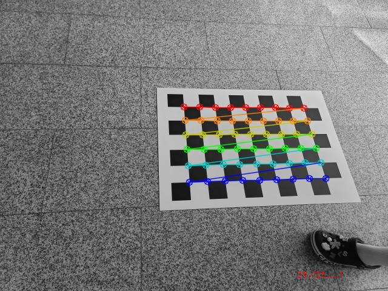
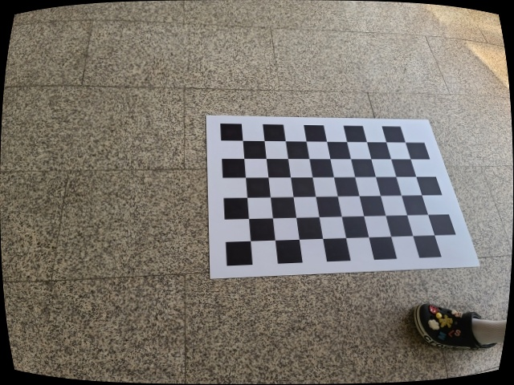

# CameraCalib2
CMakeList Project

### Tested environment
* Ubuntu 20.04.1
* OpenCV 3.4.15 
* VSCode

## Examples
```xml
<fisheye_model>0</fisheye_model>
<camera_matrix type_id="opencv-matrix">
  <rows>3</rows>
  <cols>3</cols>
  <dt>d</dt>
  <data>
    4.7832810709083469e+02 0. 3.1950000000000000e+02 0.
    4.7832810709083469e+02 2.3950000000000000e+02 0. 0. 1.</data></camera_matrix>
<distortion_coefficients type_id="opencv-matrix">
  <rows>5</rows>
  <cols>1</cols>
  <dt>d</dt>
  <data>
    1.2338483914695422e-01 -5.5156302350399189e-01 0. 0.
    1.0716738845345228e+00</data></distortion_coefficients>
<avg_reprojection_error>2.5620233609606402e-01</avg_reprojection_error>

```

<br/>
